# InkSpace - 现代化个人博客系统

<div align="center">


**基于 Go + Vue 3 构建的现代化多用户博客系统**

[功能特性](#-功能特性) • [快速开始](#-快速开始) • [技术栈](#-技术栈) • [文档](#-文档) • [许可证](#-许可证)

</div>

---

## ✨ 功能特性

### 核心功能
- ✅ **用户系统** - 注册登录、个人主页、用户关注/粉丝系统、个人资料管理
- ✅ **内容管理** - Markdown 编辑器、文章发布编辑、分类标签管理、作品展示（开源项目/摄影作品）
- ✅ **私有知识库** - 多工作区与目录知识树、文档自动保存和版本回滚、永久或限时免登录分享链接，并支持将知识库文档同步发布到博客
- ✅ **社交互动** - 评论系统（支持回复）、点赞、收藏、实时通知、用户关注
- ✅ **内容发现** - 热门文章排名、推荐文章/作品、分类浏览、标签筛选、搜索功能
- ✅ **作品展示** - 支持开源项目和摄影作品两种类型，摄影作品支持相册管理和EXIF信息
- ✅ **扩展功能** - 友情链接管理、文件上传/附件管理、访问统计
- ✅ **管理后台** - 完整的后台管理系统，包括：
  - 内容管理：文章、作品、分类、标签、评论审核
  - 用户管理：用户列表、权限管理、状态控制
  - 系统配置：首页轮播图、系统参数设置、主题风格
  - 广告管理：广告位管理、广告内容管理、广告投放
  - 友链管理：友情链接的增删改查
- ✅ **定时任务** - 独立的调度器服务，自动处理热门文章统计、数据更新等后台任务


### 功能展示

<table>
  <tr>
    <td width="50%">
      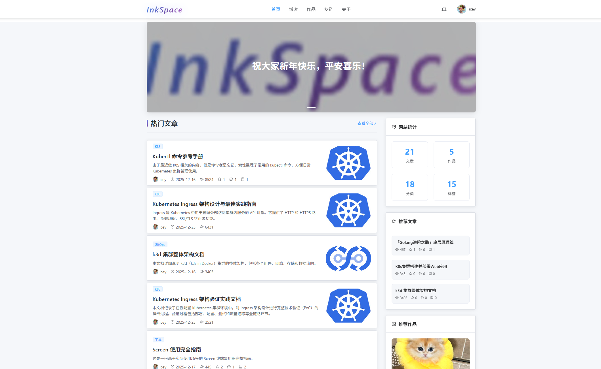
      <br/><p align="center"><b>首页 - 沉浸式阅读体验</b></p>
    </td>
    <td width="50%">
      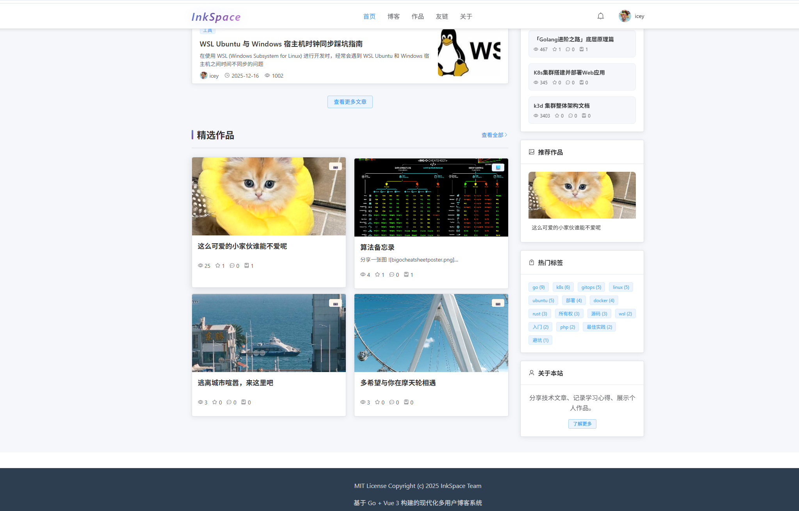
      <br/><p align="center"><b>首页 - 现代化 UI 设计</b></p>
    </td>
  </tr>
  <tr>
    <td width="50%">
      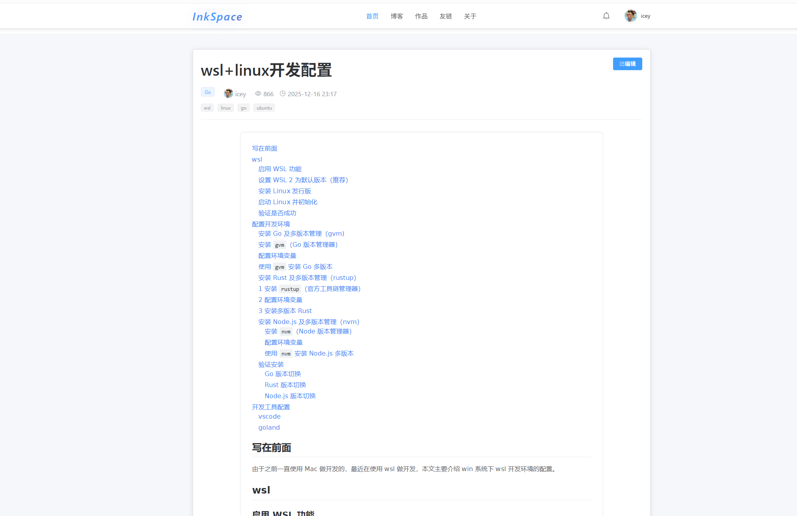
      <br/><p align="center"><b>文章详情 - Markdown 渲染与目录</b></p>
    </td>
    <td width="50%">
      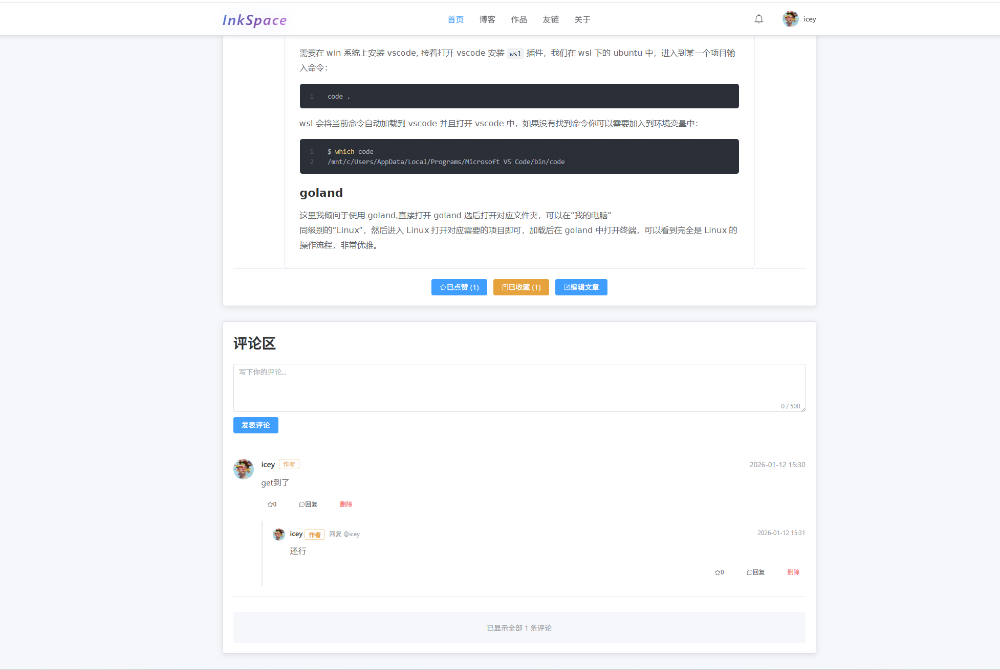
      <br/><p align="center"><b>互动区域 - 评论与社交功能</b></p>
    </td>
  </tr>
  <tr>
    <td width="50%">
      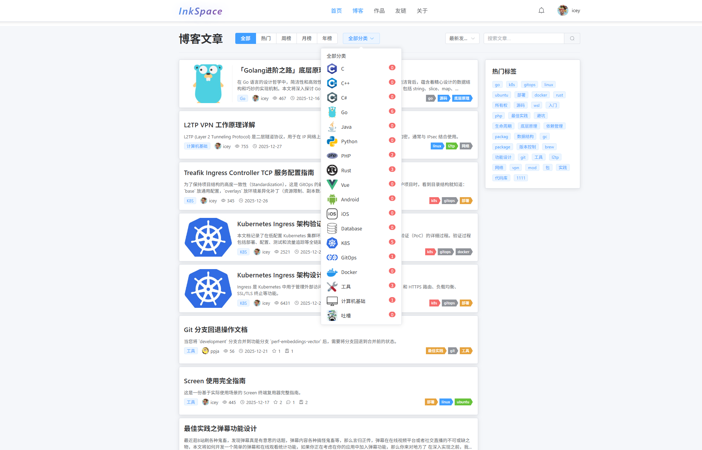
      <br/><p align="center"><b>内容发现 - 分类与标签筛选</b></p>
    </td>
    <td width="50%">
      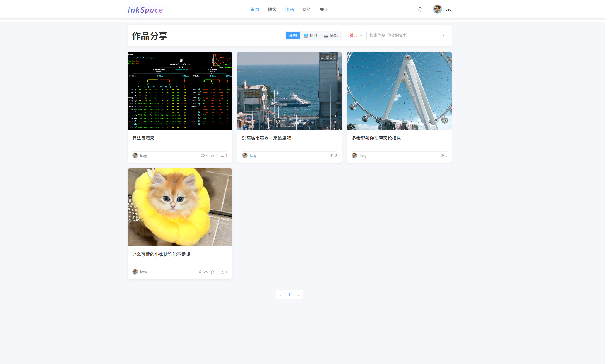
      <br/><p align="center"><b>作品集 - 项目与摄影展示</b></p>
    </td>
  </tr>
  <tr>
    <td width="50%">
      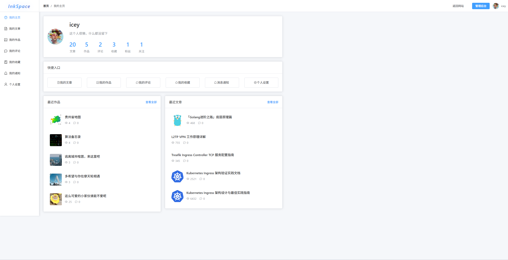
      <br/><p align="center"><b>个人中心 - 数据统计与管理</b></p>
    </td>
    <td width="50%">
      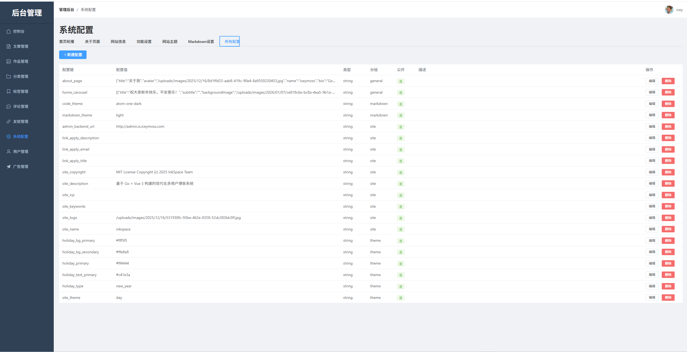
      <br/><p align="center"><b>管理后台 - 内容与系统管理</b></p>
    </td>
  </tr>
  <tr>
    <td width="50%">
      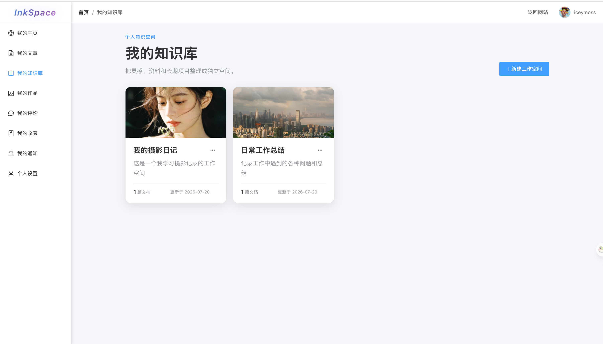
      <br/><p align="center"><b>知识库列表 - 多工作区内容管理</b></p>
    </td>
    <td width="50%">
      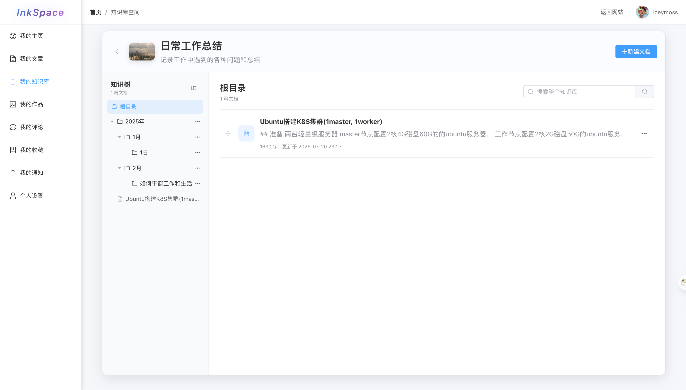
      <br/><p align="center"><b>工作区详情 - 目录与文档知识树</b></p>
    </td>
  </tr>
  <tr>
    <td width="50%">
      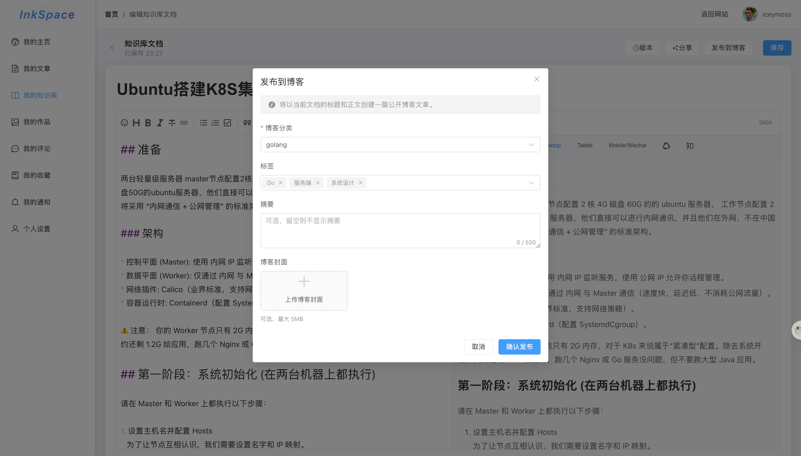
      <br/><p align="center"><b>文档编辑 - 版本管理与博客同步发布</b></p>
    </td>
    <td width="50%">
      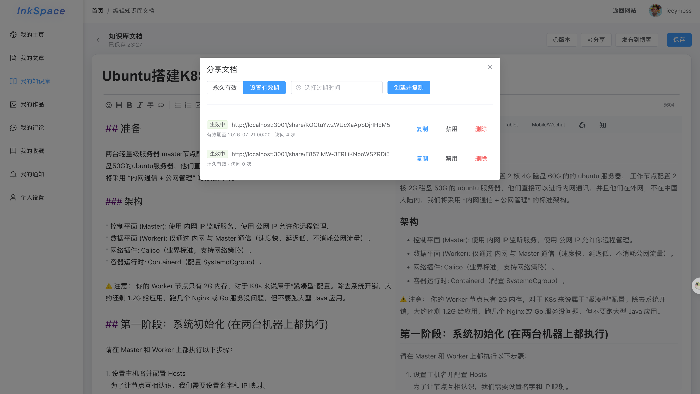
      <br/><p align="center"><b>文档分享 - 创建并管理免登录访问链接</b></p>
    </td>
  </tr>
</table>

### 为什么选择 InkSpace
- 🎯 **开箱即用** - 完整的博客系统，无需从零开始搭建
- 🚀 **快速部署** - Docker Compose 一键启动，几分钟即可上线
- 🎨 **现代化 UI** - 基于 Vue 3 和 Element Plus，界面美观易用
- 🔧 **易于扩展** - 清晰的代码结构，方便二次开发和定制
- 📱 **功能完整** - 从内容管理到社交互动，满足个人博客的所有需求

---

## 🚀 快速开始

### 前置要求

- Go 1.26+
- Node.js 18+（支持 pnpm 或 Bun）
- Docker & Docker Compose (用于数据库)
- MySQL 8.0+ 和 Redis 7+ (或使用 Docker)

### 开发环境启动

```bash
# 1. 克隆项目并安装前端依赖
git clone https://github.com/iceymoss/inkspace.git
cd inkspace
cd web/blog && pnpm install && cd ../..
cd web/admin && pnpm install && cd ../..

# 2. 启动数据库服务
docker compose up -d mysql redis

# 3. 配置环境变量（可选）
cp env.example .env
# 编辑 .env 文件修改数据库配置
```

使用 Bun 时，前端依赖安装命令可替换为：

```bash
cd web/blog && bun install && cd ../..
cd web/admin && bun install && cd ../..
```

首次使用外部 MySQL 时创建数据库；使用上面的 Compose 服务时数据库会自动创建：

```sql
CREATE DATABASE inkspace CHARACTER SET utf8mb4;
```

分别在独立终端启动需要的服务：

```bash
# 终端 1：博客/用户 API :8081
go run cmd/server/main.go

# 终端 2：管理后台 API :8083
go run cmd/admin/main.go

# 终端 3：博客前端 :3001
cd web/blog && pnpm dev

# 终端 4：管理前端 :3002
cd web/admin && pnpm dev

# 可选：定时任务调度器（无 HTTP 端口）
go run cmd/scheduler/main.go
```

使用 Bun 时，对应的前端启动命令是 `bun run dev`。

日常开发由 Vite 提供前端页面并将 `/api`、`/uploads` 代理到对应 Go 服务，不需要先构建。需要直接从 Go 端口访问前端时，先执行对应项目的 `bun run build` 或 `pnpm build`，再重启 `go run`；构建产物会写入 `internal/webassets/*/dist` 并在 Go 编译时嵌入。

**访问地址：**
- 博客前端: http://localhost:3001
- 管理后台: http://localhost:3002/login (admin / admin123)

### Docker Compose 一键部署

生产构建会先构建两个 Vue 应用，再将 blog SPA 嵌入 `server`、admin SPA 嵌入 `admin`。scheduler 镜像不构建也不包含前端资源；Nginx 只负责域名、TLS 和负载均衡，不再运行独立前端容器。

```bash
# 方式一：完整部署（包含 MySQL 和 Redis）
docker compose up -d --build

# 方式二：连接已配置好的外部 MySQL 和 Redis
docker compose -f docker-compose.external-db.yml up -d --build

# 查看服务状态和日志
docker compose ps
docker compose logs -f
```

也可以按服务单独构建生产镜像：

```bash
docker build --target server-runtime -t inkspace-server .
docker build --target admin-runtime -t inkspace-admin .
docker build --target scheduler-runtime -t inkspace-scheduler .
```

如需在本机直接从 Go 服务端口访问构建后的前端：

```bash
# blog：构建完成后重新启动 go run
cd web/blog && bun run build && cd ../..
go run cmd/server/main.go
# 访问 http://127.0.0.1:8081/

# admin
cd web/admin && bun run build && cd ../..
go run cmd/admin/main.go
# 访问 http://127.0.0.1:8083/
```

也可以使用 `./scripts/build-embedded.sh server` 或 `./scripts/build-embedded.sh admin` 同时构建前端和 `bin/` 下的 Go 二进制。生成的 hash 资源保留在本地但被 Git 忽略；前端变化后必须重新构建并重启 Go 进程。

**部署后访问：**
- 博客前端: http://is.iceymoss.com（需配置 DNS）
- 管理后台: http://admin.is.iceymoss.com（需配置 DNS）

**默认账号：**
- 管理后台: admin / admin123

> 💡 详细部署步骤、DNS 配置、HTTPS 配置等请查看 [部署文档](docs/DEPLOYMENT.md)

公网 HTTPS 使用 `docker-compose.https.yml` 叠加配置。首次签发证书、启用 HTTPS 和自动续期命令见 [HTTPS 配置](docs/DEPLOYMENT.md#https-配置)。

---

## 🛠️ 技术栈

### 后端
- **语言**: Go 1.26+
- **框架**: Gin (HTTP 路由)
- **ORM**: GORM (数据库操作)
- **数据库**: MySQL 8.0+
- **缓存**: Redis 7+
- **认证**: JWT

### 前端
- **框架**: Vue 3 (Composition API)
- **UI 库**: Element Plus
- **状态管理**: Pinia
- **构建工具**: Vite

### 部署
- **容器化**: Docker + Docker Compose
- **反向代理**: Nginx
- **负载均衡**: Nginx Upstream

---

## 📊 项目规模

| 类型 | 数量  | 说明 |
|------|-----|------|
| 数据库表 | 21张 | 完整的关系型数据库设计 |
| API 接口 | 53个 | RESTful 风格 API |
| 前端页面 | 21个 | Vue 3 + Element Plus |
| 服务模块 | 12个 | Service 层业务逻辑 |

---

## 📚 文档

- 🚀 [部署文档](docs/DEPLOYMENT.md) - 生产环境部署指南（Docker Compose）
- 🗄️ [数据库设计](docs/database-design.md) - 数据库表结构设计说明

---

## ⚙️ 配置说明

项目支持多种配置方式，优先级从高到低：

1. **环境变量** - 系统环境变量
2. **.env 文件** - 项目根目录下的 `.env` 文件
3. **YAML 配置文件** - `config/config.yaml` 和 `config/admin.yaml`

主要配置项：
- 数据库连接（MySQL）
- Redis 连接
- JWT 密钥
- 服务端口

完整配置说明请参考 `env.example` 文件。

---

## 🏗️ 项目结构

```
inkspace/
├── cmd/                    # 服务入口
│   ├── server/            # 用户服务 (8081)
│   ├── admin/             # 管理服务 (8083)
│   └── scheduler/         # 定时任务调度器
├── internal/              # 内部代码
│   ├── config/            # 配置管理
│   ├── database/          # 数据库连接和迁移
│   ├── handler/           # HTTP 处理器
│   ├── middleware/        # 中间件
│   ├── model/             # 数据模型
│   ├── router/            # 路由定义
│   ├── service/           # 业务逻辑层
│   └── webassets/         # blog/admin SPA 嵌入资源
├── web/                   # 前端项目
│   ├── blog/             # 博客前端
│   └── admin/            # 管理后台前端
├── config/                # 配置文件
├── scripts/               # 脚本文件
├── nginx/                 # Nginx 配置
├── Dockerfile             # 双前端构建和三个 Go 运行镜像 target
├── docker-compose.yml     # Docker Compose 配置
├── docker-compose.external-db.yml # 使用外部数据库的 Docker Compose 配置
├── deploy/                # GitOps 部署方案（Docker + Kubernetes + Argocd）
├── gitlab-ci.yml          # GitLab CI/CD 配置
└── docs/                  # 项目文档
```

---

## Star 趋势

[](https://www.star-history.com/#iceymoss/inkspace&Date)

---

## 🤝 贡献

欢迎提交 Issue 和 Pull Request！

1. Fork 本仓库
2. 创建特性分支 (`git checkout -b feature/AmazingFeature`)
3. 提交更改 (`git commit -m 'Add some AmazingFeature'`)
4. 推送到分支 (`git push origin feature/AmazingFeature`)
5. 开启 Pull Request

---

## 📄 许可证

本项目采用 [MIT License](LICENSE) 许可证。

---


<div align="center">

**如果这个项目对你有帮助，请给一个 ⭐ Star！**

Made with ❤️ by InkSpace Team

</div>
